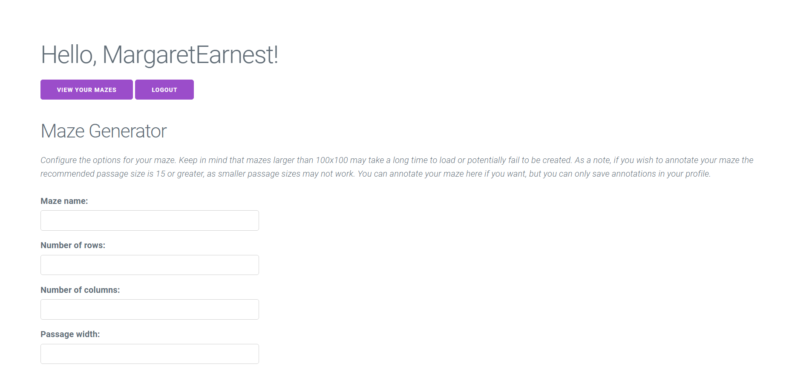
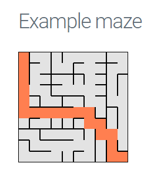

## Maze Generator

Margaret Earnest

[https://a3-margaretearnest.glitch.me/login](https://a3-margaretearnest.glitch.me/login)  
(sorry that the url doesn't have the dash between names; I had an issue changing it)

This website is desgined to let users create, annotate, and save customized mazes. First the site authenticates with GitHub,
which I chose to use to avoid storing user accounts in my database. Then, the user is taken to a page where new mazes can be created
with options for the number of columns and rows, the passge width, whether or not the maze can be annotated, and annotation color.
This form features text, number, checkbox, and radio inputs.  

  
Finally, the user may review all mazes created in their profile and edit the name and annotation of any maze. Mazes can also be deleted
from here. I used Milligram as my CSS framework because it is easy to implement, it requires no configuration, and I like the color purple.
The only CSS changes I made were to make forms only 30% of the page width since they looked too long and to give the body a 5% margin since
Milligram had no margin on the body. While making this site, I had some trouble implementing authentication and making maze annotation work
in a way that made sense. I also hit the default limit for json conversion size, so I had to lift it manually. Five Express Middleware packages
that I used are body-parser, which I used to extend the json limit and parse json, morgan, which automatically logs requests to the site, compression,
which compresses HTTP requests, express-session, which I used to make a secure session, and connect-timeout, which I used to set the timeout
on requests to 30 seconds for the case of very large mazes being transferred.

## Technical Achievements

- **GitHub Authentication**: I used OAuth authentication via the GitHub strategy.
