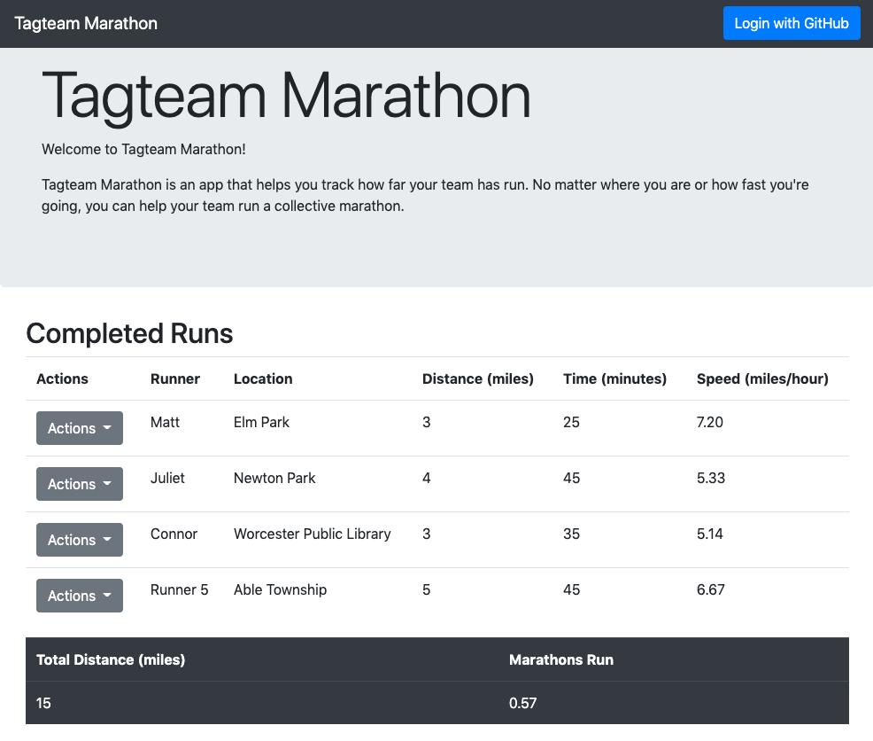
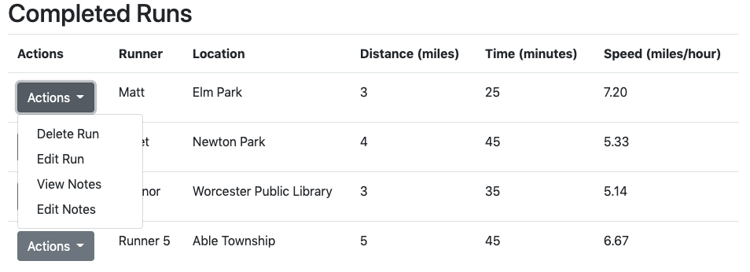
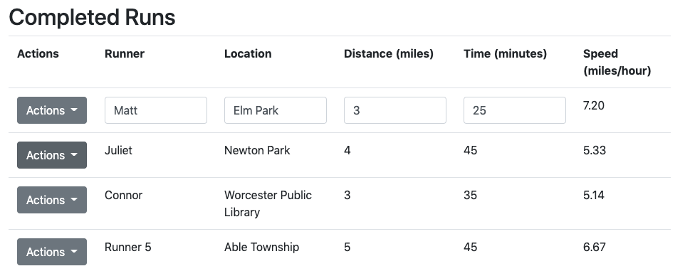

# Tagteam Marathon (v2.0)
CS 4241 Webware A3-Persistence - Matthew St Louis

Submission: [a3-matthew-stlouis.herokuapp.com](https://a3-matthew-stlouis.herokuapp.com)

1. [Tagteam Marathon (v2.0)](#tagteam-marathon-v20)
   1. [Core Assignment](#core-assignment)
      1. [Goal](#goal)
      2. [Usage](#usage)
      3. [Required Components Checklist](#required-components-checklist)
      4. [Authentication](#authentication)
      5. [CSS Framework](#css-framework)
      6. [Express Middleware](#express-middleware)
      7. [Challenges](#challenges)
         1. [Passport.js](#passportjs)
         2. [Middleware](#middleware)
         3. [Huroku](#huroku)
   2. [Technical Achievements](#technical-achievements)

## Core Assignment
### Goal
This project is a new version of my project for the last assignment - [Tagteam Marathon](https://github.com/mastlouis/a2-shortstack), but most of the code has been changed.

Tagteam Marathon is an app to help teams of runners share their runs with each other and track their collective progress. The intended use of this is for runners who want to have a social aspect to their runs without physically meeting up during the time of social distancing. Users can log in with GitHub to add, modify, and delete runs.

Currently, runs are tied to specific accounts, and there is no way to share runs across accounts, so the app is only suited for runners tracking their runs as an individual. However, the app provides all functionality necessary to meet this goal.

### Usage
To get started with TagTeam marathon, sign in with GitHub using the button in the upper right of the page.

__The first time you sign in, you will get an `alert()` notifying you that an account has been created with the app. It will only appear once. Please do not miss it.__

You can add new runs via the New Run form at the bottom of the page. Submit with the Submit button.

Once you have submitted a run, it will display in the Completed Runs table. This table will initially be empty, as the new user will not have any runs before they add one.

You can view the notes in a saved run with the __View Notes__ button in the __Completed Runs__ table under the __Actions__ menu. You can edit these notes with the __Edit Notes__ button in the same menu.

To delete a run, use the __Delete Run__ button in the __Actions__ menu on the __Completed Runs__ table.

To modify a run, use the __Edit Run__ button in the __Actions__ menu on the __Completed Runs__ table. This will transform the relevant table entries to inputs where the user can edit the data. Save this with the __Submit Edits__ button that now appears under the __Actions__ menu, or discard changes either with the __Cancel Edits__ button under the __Actions__ menu or by editing another run.

### Required Components Checklist
- [x] A `Server`, created using Express
- [x] A `Results` functionality which shows the entire dataset residing in the server's memory
  - The professor specified in the Microsoft Teams chat that it would be sufficient to display all data relevant to the user who is currently logged in. This data all displays in the __Completed Runs__ table.
- [x] A `Form/Entry` functionality which allows users to add, modify, and delete data items associated with their user name / account.
  - The user may enter a new run through the __New Run__ form to add data. The user may delete a run using the __Delete Run__ button on the Actions menu corresponding to the target run. The user may edit a run using the __Edit Run__ button on the Actions menu corresponding to the target run.
- [x] Use of at least five Express middleware packages
  - Middleware
    - express-lowercase-paths
    - serve-favicon
    - helmet
    - connect-rid
    - connect-timeout
  - Use of middleware is detailed further [here](#express-middleware).
- [x] Persistent data storage in between server sessions using [mongodb](https://www.mongodb.com/cloud/atlas)
- [x] Use of a CSS framework or template.
  - I used Bootstrap for almost all of the styling.
- [x] HTML input tags and form fields of various flavors (`<textarea>`, `<input>`, checkboxes, radio buttons etc.)
  - A _text-flavored input_ was used for collecting the name and location on a new run.
  - A _number-flavored input_ was used for collecting the distance and time on a new run.
  - A _textarea_ was used for collecting notes on a new run.
- [x] HTML that can display all data *for a particular authenticated user*. 
  - The __Runs Table__ Displays all of a user's runs and can be used to access all data for each run.
- [x] Create new user accounts upon login if none exist, however, you must alert your users to this fact.
  - __When a new user creates an account, they will get a single `alert()` notification to tell them that they a new account has been created for them. This will only appear once.__
- [x] A small amount of front-end JavaScript to get / fetch data from the server.
  - This is contained in the [script.js](./public/script.js) file.

### Authentication
I chose to go with the GitHub authentication strategy with Passport.js for the design achievement and because I wanted practice with external SSO, and GitHub seems like a practical choice for potential future projects. I feel like I could use this to secure a small webapp in the future. This is discussed further in my [technical achievements section](#technical-achievements).

### CSS Framework
I chose Bootstrap as my CSS framework because it has the largest userbase of any major CSS framework. I personally think Bootstrap looks tired and ugly, but I figure that it is a skill I should have in case I encounter a project that uses bootstrap in the future.

The only real modifications I made to the CSS was to hide the login view and display the page content if a user is authenticated.

### Express Middleware
Here are the five pieces of middleware I implemented in my server and what they help with:
- __express-lowercase-paths__
  - Converts all request paths (e.g. GET, POST) to lowercase. This makes the requests slightly more resilient
- __serve-favicon__
  - Used to serve the running shoe favicon for the app
- __helmet__
  - Attaches a set of responses to all outgoing responses and refuses certain insecure requests. This increases security.
- __connect-rid__
  - Issues an ID to requests to keep better track of them.
- __connect-timeout__
  - Times out requests after a specified interval (I set mine to be five seconds)

I also used some middleware to implement the OAuth, but my understanding is that it would not double-count toward the five required pieces of middleware. They are as follow:
- __passport__
- __passport-github__
- __connect-ensure-login__
- __morgan__
- __cookie-parer__
- __express-session__

I forgot until writing this that I am also using __body-parser__.

### Challenges
The most significant challenges I ran into for this project were working with Passport.js, implementing 5 pieces of middleware, and uploading to Huroku.

#### Passport.js
Passport.js was by far the greatest time sink in this project for me. I tried following a few different tutorials, but I kept running into small issues with exactly how it's supposed to work. Most of the tutorials I found used a login page, which I do not, and I did not understand why Passport.js should work differently in terms of authentication whether or not the application has a login page to redirect to.

Here is a sample of some of the problems I ran into:
- Finding the correct parameters for `passport.authenticate()`
- Including port number when registering with GitHub
- Figuring out the right series of redirects for incoming and outgoing authentication requests
- Registering for an ID and Secret with GitHub
- Wading through EJS in the examples for Passport.js
- Determining which Middleware from the examples was and was not important to authenticating the user
- Storing URLs in the `.env` file to change them out when deployed without changing them locally.
- Removing the port number from authentication and callback URL's when deploying to Heroku.

Setting up Passport.js consumed roughly a day of work for me.

#### Middleware
The second challenge I ran into was finding five pieces of middleware to incorporate [listed above](#express-middleware). My app didn't really need middleware aside from those used for other requirements, so I felt like I was reaching to find it.

Hemlet.js alone cost me about an hour. I installed it without issue, but it prevented me from accessing Bootstrap through a CDN. I tried downloading a local copy of Bootstrap, but this was likewise thwarted. I spent a while looking for other workarounds before going through the Helmet.js documentation to loosen the security constraints and to allow external requests.

#### Huroku
Uploading to Huroku was not too challenging, but I think it was significant enough to mention. 

I fumbled with Digital Ocean for about an hour before giving up on it. I downloaded an authenticator app and went through account setup before realizing that there was no free tier. I tired to host it there anyway, but I could not get my code onto the server. I tried VS Code's SSH, but it wasn't working, and I tried their web terminal, which was unresponsive.

When I switched to Heroku, I spent a good hour just trying to get the GitHub Authentication to work again. The URL's are very finnicky. I got to the point where I tried reformatting the strings for the callback URL a few times, and one of them worked. I don't know what I did differently the time it worked, but it must have been something.

## Technical Achievements
I used OAuth authentication via the GitHub strategy using passport.js and the following middleware:
- __passport__
- __passport-github__
- __connect-ensure-login__
- __morgan__
- __cookie-parer__
- __express-session__
It was good to get some experience writing an app with user accounts and externally managed security. The difficulties for this are mentioned [above](#passportjs).

I hosted the site on [Heroku](https://www.heroku.com) rather than Glitch. Heroku looks like it can easily handle more complicated builds than Glitch, but the experience was certainly not as user-friendly for setting up the project, going through logs, and setting environment variables. However, one thing that Heroku excels at where I feel Glitch comes up short is with GitHub integration. I have Heroku set up to automatically rebuild and redeploy the project every time I commit to this branch on GitHub, whereas  I find Glitch's process for manually importing a project from GitHub a bit cumbersome.
